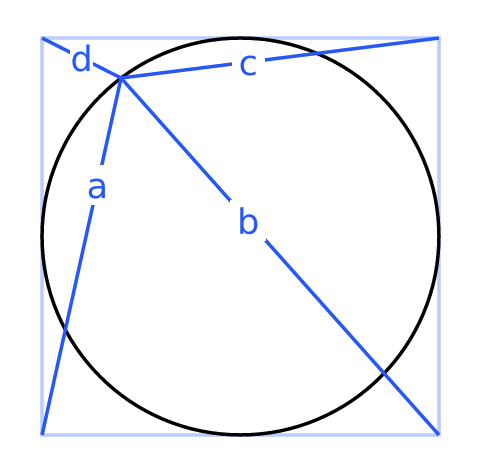

## Problem 1

{.small-image}

Find: $a^2 + b^2 + c^2 + d^2$

---

Source: [Mirangu.com](https://mirangu.com/wheel-of-fortune/). I posted two answers on Twitter/X, [here](https://x.com/tcorbettclark/status/1692831256810037358) and [here](https://x.com/tcorbettclark/status/1692585115371577465).

Written up PDF [here-TODO](TODO), which also considers any number of sides (not just a square).
