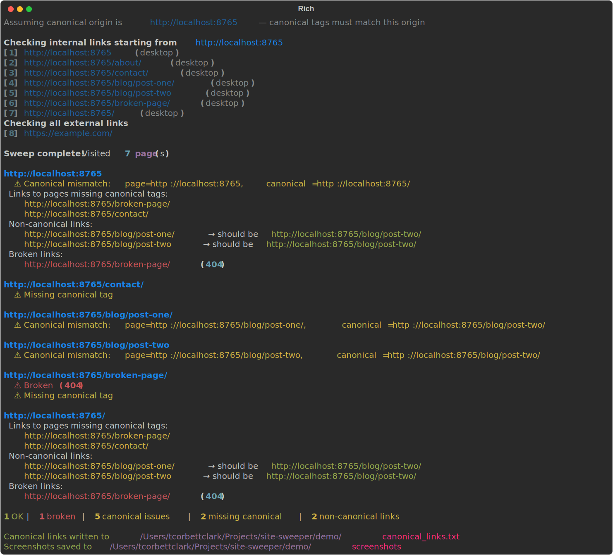

## What is it?

A command-line tool to sweep all the pages of a website, checking for broken links and canonical tag issues, taking screenshots, and generating sitemap data.

## Features

- **Crawl & traverse** — recursively follows all internal links from a starting URL
- **Broken link detection** — identifies internal pages returning 4xx/5xx status codes
- **Canonical tag validation** — checks for missing, mismatched, or malformed `<link rel="canonical">` tags
- **Non-canonical link detection** — flags internal links that point to non-canonical URLs (e.g. linking to `/page` when the canonical is `/page/`)
- **External link checking** — optionally verifies that external links are reachable
- **Screenshots** — captures page screenshots at configurable viewport sizes (mobile, tablet, desktop, desktop-lg)
- **Canonical links file** — writes a list of canonicalised internal paths for sitemap generation

For details, see the [GitHub repository](https://github.com/tcorbettclark/site-sweeper).
